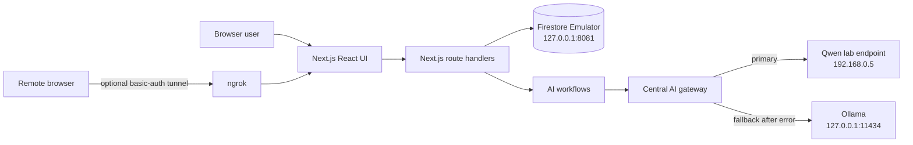
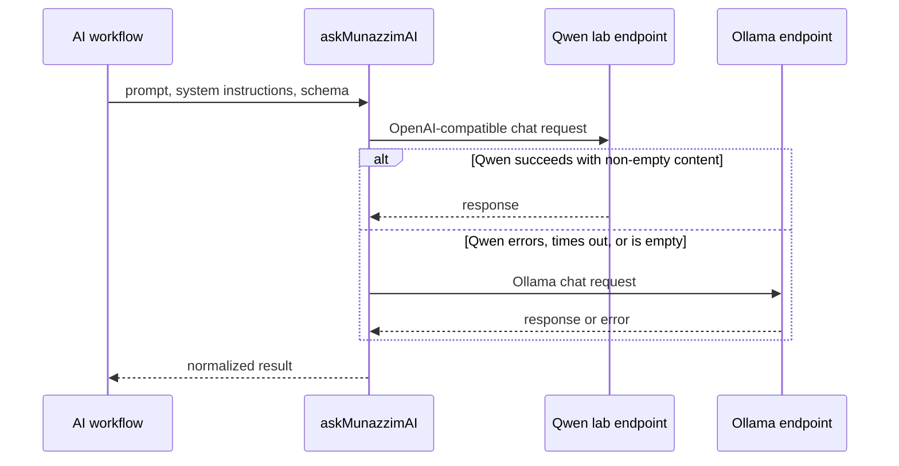

# Munazzim AI Time Manager: Current Technical Documentation

**Document date:** 2026-08-31  
**Scope:** Current repository implementation  
**Evidence basis:** Source code, configuration, scripts, Git metadata, recorded project-work tests, Windows demonstrations, and Ubuntu laboratory demonstrations

## Executive Summary

Munazzim is a Next.js 15 and TypeScript time-management application with task, appointment, calendar, statistics, AI-assistant, and schedule-analysis interfaces. Data operations are implemented through Next.js route handlers and the Firebase client SDK, with server-side code explicitly connected to a local Firestore Emulator. The AI layer uses a central custom gateway that attempts an OpenAI-compatible Qwen endpoint on a laboratory network and falls back to a local Ollama endpoint.

The strongest current implementation is the controlled AI proposal pipeline: the application classifies the user's request, requests structured JSON, sanitizes structural defects, applies an intent gate, removes exact duplicates from the proposal, presents proposed task and appointment actions, and requires an explicit user action before those items are written. The API repeats format validation and exact duplicate checks before Firestore writes.

The project has progressed beyond source-only proof. Windows local operation and Ubuntu laboratory operation have been demonstrated. In Ubuntu, Next.js, the Firestore Emulator, the Firebase Auth Emulator, Ollama, and ngrok were run together; the application was accessed locally and remotely through ngrok. AI Assistant, AI Performance, task and appointment persistence, validation/sanitization, duplicate protection, and backup creation received functional tests. AI Performance returned a valid analysis and exactly three recommendations in multiple tests.

These demonstrations do not establish production qualification. Authentication remains a hardcoded `public-guest` identity, calendar synchronization uses a fixed mock event, production Firestore is not configured in the active server path, and the repository's nominal automated tests are simulations. Direct Qwen connectivity and inference were demonstrated from Ubuntu, including a valid final response with thinking disabled, but complete application-level Qwen integration remains **NOT VERIFIED**. Nginx and backup restoration also remain **NOT VERIFIED**.

## Evidence Classification

| Evidence class | Evidence currently available | Boundary |
|---|---|---|
| Source-code evidence | Architecture, APIs, gateway, schemas, sanitizer, duplicate checks, emulator and ngrok scripts | Shows implementation, not execution |
| Local functional testing | AI Assistant, AI Performance, persistence, validation/sanitizer, duplicates, and backup creation were exercised | Test automation and full regression coverage remain limited |
| Ubuntu laboratory demonstration | Next.js, Auth Emulator, Firestore Emulator, Ollama, and ngrok ran together; local and remote access were demonstrated | Laboratory operation is not automatically a fully relevant environment |
| Windows local demonstration | Next.js and Firebase emulators ran and the application was reached locally; Ollama fallback was exercised | Windows could not reach the Ubuntu-lab Qwen address in the recorded cross-host check |
| AI model validation | Ollama application flows were exercised; Qwen direct inference passed with `enable_thinking:false`; AI Performance repeatedly returned three recommendations | Full application-level Qwen validation and broad semantic quality remain open |
| Relevant-environment validation | Some representative local/remote workflows were demonstrated in the Ubuntu lab | Real identity, production persistence, real calendar integration, scale, security, and sustained operation remain absent |

## Project Purpose

The implemented product supports personal schedule management through:

- manual task and appointment creation, update, status change, and deletion;
- a combined calendar view of stored tasks and appointments;
- local statistics calculated from stored records;
- natural-language generation of proposed tasks and appointments;
- AI-generated schedule summaries and recommendations; and
- limited AI interaction logging.

The current repository does not prove secure multi-user operation, real external-calendar integration, notification delivery, recurring events, or production readiness. Those capabilities appear in older descriptive documents but are not implemented or demonstrated by the current source.

## System Scope

### In scope and implemented in code

| Area | Current implementation | Primary evidence |
|---|---|---|
| Web application | Next.js App Router application with React client pages | [`src/app`](../src/app), [`package.json`](../package.json) |
| User interface | Dashboard, calendar, appointments, tasks, AI assistant, statistics, and logs navigation | [`src/components/layout/app-layout.tsx`](../src/components/layout/app-layout.tsx) |
| Persistence API | CRUD route handlers for tasks and appointments; read/write route for AI logs | [`src/app/api/tasks/route.ts`](../src/app/api/tasks/route.ts), [`src/app/api/appointments/route.ts`](../src/app/api/appointments/route.ts), [`src/app/api/ai-logs/route.ts`](../src/app/api/ai-logs/route.ts) |
| AI gateway | Qwen primary provider with Ollama fallback | [`src/ai/ai-client.ts`](../src/ai/ai-client.ts) |
| AI workflows | Intent classification, action extraction, schedule analysis, performance analysis | [`src/ai/flows/ai-schedule-optimizer-flow.ts`](../src/ai/flows/ai-schedule-optimizer-flow.ts), [`src/ai/flows/ai-performance-analysis-flow.ts`](../src/ai/flows/ai-performance-analysis-flow.ts) |
| Local laboratory data services | Firestore and Auth emulator configuration | [`firebase.json`](../firebase.json), [`src/lib/firebase.ts`](../src/lib/firebase.ts) |
| Linux-oriented operations | Start, stop, ngrok, emulator export, and local backup scripts | [`start-munazzim.sh`](../start-munazzim.sh), [`stop-munazzim.sh`](../stop-munazzim.sh), [`backup-munazzim-data.sh`](../backup-munazzim-data.sh) |
| Container build | Multi-stage Node 20 Alpine image and standalone Next.js output | [`Dockerfile`](../Dockerfile), [`next.config.ts`](../next.config.ts) |

### Explicitly outside the verified scope

- Real Firebase Authentication and distinct user sessions: **NOT IMPLEMENTED / NOT VERIFIED** in the active request identity path.
- Real Google or other external calendar integration: **NOT IMPLEMENTED / NOT VERIFIED**; the sync route uses one hardcoded mock event.
- Nginx reverse proxy or TLS termination: **NOT VERIFIED**; no Nginx configuration exists in the repository.
- Production Firebase/Firestore operation: **NOT VERIFIED**; server code always targets the local emulator.
- Hugging Face deployment represented by the README link: **NOT VERIFIED** during this review.
- Notifications, reminders, recurring events, and full Arabic RTL behavior: **NOT VERIFIED** in the current implementation.

## Current System Architecture

The browser accesses application data through same-origin API routes. A localhost browser may also initialize direct emulator connections, but pages reviewed for tasks, appointments, calendar, statistics, and AI use the application APIs. A remote browser reached through ngrok is intentionally prevented from connecting directly to localhost Firebase services; the Next.js server remains the data-service intermediary.

## Frontend Architecture

The frontend is implemented with React 19 client components under the Next.js App Router. Styling uses Tailwind CSS and reusable Radix-based components under [`src/components/ui`](../src/components/ui). Lucide supplies icons and Recharts supplies statistics charts.

[`src/app/layout.tsx`](../src/app/layout.tsx) installs the guest authentication context and toast system globally. [`src/components/layout/app-layout.tsx`](../src/components/layout/app-layout.tsx) provides the shared sidebar and navigation. The principal screens are:

| Route | Responsibility |
|---|---|
| `/` | Dashboard and schedule overview |
| `/calendar` | Date selection and combined daily tasks/appointments |
| `/appointments` | Appointment CRUD and attendance state |
| `/tasks` | Task CRUD, priority, and completion state |
| `/ai-assistant` | Natural-language request, proposal review, and explicit save |
| `/stats` | Client-calculated task and appointment statistics |
| `/logs` | AI log display |

The UI uses English and left-to-right layout at the application shell. Individual AI text areas and result blocks use automatic text direction. Full application-wide Arabic RTL behavior is therefore **NOT VERIFIED**.

## Backend and API Architecture

The backend consists of Next.js route handlers in [`src/app/api`](../src/app/api). There is no separate service process or server framework in the repository.

| Endpoint | Current behavior |
|---|---|
| `/api/tasks` | GET, POST, PATCH, and DELETE against `tasks` |
| `/api/appointments` | GET, POST, PATCH, and DELETE against `appointments` |
| `/api/ai/assistant` | Loads the guest schedule and runs the combined AI workflow |
| `/api/ai/performance` | Loads the guest schedule and produces three recommendations |
| `/api/ai-logs` | Stores and returns the five most recent AI interaction records |
| `/api/calendar-sync` | Inserts or updates one hardcoded mock event |
| `/api/user/sync` | Echoes supplied guest details; does not authenticate or persist the user |
| `/api/health` | Returns static component labels and process uptime |

The task and appointment routes ignore a client-supplied `userId` and obtain identity from `getCurrentUserId()`. This is a useful boundary, but the identity provider currently always returns `public-guest`.

## AI Architecture

### Central AI Gateway

[`src/ai/ai-client.ts`](../src/ai/ai-client.ts) is the only source module that directly calls model servers. Product workflows call `askMunazzimAI()`. The returned metadata normalizes provider name, model name, finish reason, token counts when available, and response time.

The gateway performs sequential failover, not load balancing. If both providers fail, it throws `Both Qwen and local Ollama are unavailable.` Provider errors are logged to the server console.

### Qwen Integration

The primary URL defaults to `http://192.168.0.5/v1/chat/completions`; the model defaults to `/models/Qwen3.5-2B-BF16.gguf`. Both can be overridden with environment variables. Requests use the OpenAI-compatible message structure, disable model thinking through `chat_template_kwargs`, support JSON object or strict JSON Schema response formats, and default to a 120-second timeout.

Direct Qwen network connectivity and inference were demonstrated from the Ubuntu laboratory host. Testing identified that thinking-enabled requests could return `reasoning_content` without final `content`; setting `chat_template_kwargs.enable_thinking` to `false` produced a valid final response (`"OK"`) in approximately 0.569 seconds. The current gateway includes that setting. A separate Windows-hosted application test could not reach `192.168.0.5` and correctly used Ollama. These results validate the direct Qwen endpoint behavior and the identified thinking-mode control, but do not prove a completed Munazzim application request through Qwen. Full application-level Qwen integration is **NOT VERIFIED**.

### Ollama Fallback

The fallback URL defaults to `http://127.0.0.1:11434/api/chat` with model `llama3.2:3b`. It uses non-streaming responses, a 30-minute keep-alive, JSON/schema format requests when needed, a maximum of 500 predicted tokens, and a 180-second timeout.

Ollama was demonstrated as an active application fallback in local testing. AI Assistant and AI Performance were exercised through the application, and AI Performance produced a valid analysis with exactly three recommendations in multiple tests. Earlier testing also exposed semantic defects in an Arabic task result, including wrong or invented schedule fields. The current `parseAIJson()` is a direct `JSON.parse()` after removing wrappers; the Unicode repair described in the old phase-one audit is not present in the current source. The demonstrated successful analysis behavior therefore coexists with unresolved broad multilingual and semantic-quality validation.

### AI Assistant Workflow

The assistant uses a two-model-call design before canonical response generation:

1. `requestIntent()` asks the active provider to classify requested actions and whether optional values were explicitly supplied.
2. `workspaceFacts()` calculates aggregate schedule counts when analysis was requested.
3. `requestCanonicalResponse()` asks for a fixed response containing `reply`, `tasks`, `appointments`, and `analysis`.
4. Invalid JSON receives one retry. A malformed or schema-invalid final response is rejected.
5. Sanitizers remove invalid structural values and produce warnings.
6. `applyIntentGate()` removes unrequested actions and clears optional task fields not classified as explicit.
7. `removeExactDuplicates()` removes exact matches against the loaded schedule and within the response.
8. The UI displays the response. Proposed tasks and appointments are not written until the user selects **Save AI Actions**.

Because request intent is itself model-derived, it is not an independent deterministic proof of user intent. The gate reduces one class of unwanted output but still depends on model classification correctness.

### AI Performance Workflow

[`src/ai/flows/ai-performance-analysis-flow.ts`](../src/ai/flows/ai-performance-analysis-flow.ts) computes schedule facts in TypeScript and asks the model for a summary plus exactly three suggestions. If the first valid response does not contain three suggestions, the workflow retries once and applies a strict Zod schema. The dashboard widget displays a short result and a full-report dialog. This workflow is read-only with respect to tasks and appointments.

AI analysis quality, factual grounding across representative schedules, and repeatability are **NOT VERIFIED**. The prior audit notes that the Ollama model produced an inadequate analysis during one exercise.

### Structured AI Output

The assistant and performance workflows define both provider-facing JSON Schemas and application-side Zod schemas. Qwen receives `response_format.type = json_schema` with `strict: true`; Ollama receives the schema through its `format` property. Model text is stripped of `<think>` blocks and Markdown JSON fences before parsing.

Schema requests do not by themselves prove provider compliance. The code performs local validation after parsing and converts invalid final outputs into a failure rather than a database action.

### Validation and Sanitizer Layer

The AI action sanitizer:

- requires non-empty task and appointment titles;
- accepts task dates only in `YYYY-MM-DD` form;
- accepts times only in 24-hour `HH:mm` form;
- permits only `High`, `Medium`, `Low`, or null task priorities;
- requires complete appointment date/start/end fields;
- rejects appointment ranges whose end is not after the start;
- treats null, undefined, empty strings, and literal `"null"`/`"undefined"` values as absent in selected fields;
- drops invalid sections or fields and returns user-visible warnings; and
- does not invent replacement dates, times, priorities, or intent.

The persistence APIs separately normalize strings and validate date/time formats. They do not apply comprehensive Zod object schemas, length limits, enumeration checks for all statuses/priorities, or content-size limits.

## Data Creation and Analysis Flows

### Task Creation Flow

Manual task creation posts from the Tasks page to `/api/tasks`. AI-assisted creation first produces a proposal on `/ai-assistant`; an explicit save then posts each task separately. The server chooses `title || description`, normalizes optional date/time, validates formats, performs an exact duplicate query, and calls Firestore `addDoc()` when no duplicate is found.

The assistant sends `source: "ai_generated"`, but the task POST route does not include `source` in the stored object. AI provenance for task records is therefore **not persisted by the current task route**.

### Appointment Creation Flow

Manual appointment creation posts to `/api/appointments`. AI proposals require date, start time, and end time before reaching the UI. On confirmation, appointments are posted individually. The server validates date and time forms, requires paired start/end values, ensures end is later than start, creates a canonical time range, checks exact duplicates, and writes with `addDoc()`.

The assistant sends `source: "ai_generated"`, but the appointment POST route does not persist the `source` field. The mock calendar-sync route does persist `source: "calendar_import"`.

### Analysis Flow

Schedule statistics supplied to models are calculated by [`src/ai/schedule-facts.ts`](../src/ai/schedule-facts.ts). They include task completion, pending and overdue counts, today's items, and appointment attendance categories. The assistant receives aggregate facts only when intent classification requests analysis. The dedicated performance endpoint always loads the schedule and sends aggregate facts.

There is no deterministic evaluator that checks whether generated prose faithfully uses those facts. HTTP 200 or schema validity must not be interpreted as semantic correctness.

## Persistence and Environment

### Firestore Persistence

The active collections are `tasks`, `appointments`, and `ai_logs`. Server routes use the Firebase web SDK rather than the Firebase Admin SDK. Server initialization always calls `connectFirestoreEmulator(db, "127.0.0.1", 8081)`, so production Firestore access through these routes is not represented by the current code.

Task and appointment reads retrieve all records for the current hardcoded user. There is no pagination, server-side ordering, migration mechanism, repository-defined indexes, or transaction around multi-item AI saves.

### Firebase Emulator Usage

[`firebase.json`](../firebase.json) exposes Firestore on `0.0.0.0:8081`, Auth on `0.0.0.0:9099`, and enables the Emulator UI. The Linux start script imports `./emulator-data` and requests export on exit. Localhost browsers also connect directly to both emulators, while non-local browsers rely on Next.js APIs.

No Firestore Security Rules file is present. Emulator data and environment files are excluded by [`.gitignore`](../.gitignore). The existence and correctness of local emulator data are **NOT VERIFIED** in this documentation review.

### Authentication and Ownership

Authentication is demo-only:

- the client creates a fixed guest object with UID `public-guest`;
- `AuthGuard` only waits for client mounting and performs no access decision;
- registration and login pages do not establish the identity used by APIs;
- every API request resolves to `public-guest`; and
- the user sync endpoint echoes submitted fields without authentication or persistence.

The task and appointment APIs correctly ignore client-supplied user IDs, filter reads by the server-resolved identity, and check stored ownership before updates or deletes. However, because all callers share one identity, these checks do not provide real user isolation.

### Duplicate and Idempotency Protection

AI results are deduplicated in memory using lowercased composite keys. Task persistence checks `userId + title + date + time`; appointment persistence checks `userId + title + date + stored time`. Calendar mock imports use `userId + externalId` and update an existing record.

These checks provide practical repeat-submit protection for exact matches, but they are not transactional. Concurrent requests can both observe no duplicate and create duplicates. Semantic duplicates, whitespace/case variations at the API layer, and changed time representations are not covered. No client-generated idempotency key is used.

### Confirmation Before Database Writes

AI-generated tasks and appointments require the user to press **Save AI Actions**. There is no automatic task or appointment write after analysis alone. This is implemented in [`src/app/ai-assistant/page.tsx`](../src/app/ai-assistant/page.tsx).

An important exception is AI interaction logging: after a successful assistant response, the UI attempts to write an `ai_logs` record automatically and silently. Therefore, confirmation applies to proposed schedule actions, not to every database write associated with an AI request.

### Error Handling

API routes wrap handlers in `try/catch`, log server errors, and return JSON error bodies. Common validation failures return HTTP 400, ownership/not-found cases return 404, persistence failures return 500, and AI workflow failures return 502. The UI uses toast notifications and clears loading states in `finally` blocks.

Limitations include broad `any` error types, exposure of some caught error messages to clients, console logging of raw model responses and user prompts, no centralized redaction policy, no retry/backoff for Firestore writes, and no rollback when one item in a multi-item save fails.

## Operating Environments

### Windows Environment

Windows local operation was demonstrated. Next.js ran under Windows `node.exe`, the Firestore Emulator and Auth Emulator were available, the application returned HTTP 200 locally, and an application AI request used the local Ollama fallback when the Windows host could not reach the Ubuntu-lab Qwen address. TypeScript validation also passed through the Windows `.cmd` compiler. The repository's full operational scripts remain Bash/Linux-oriented, so a complete native Windows start/stop/backup runbook is **NOT VERIFIED**.

### Ubuntu Laboratory Environment

Ubuntu laboratory operation was demonstrated. Next.js, Firestore Emulator, Firebase Auth Emulator, Ollama, and ngrok were shown running as the application stack. The application was accessed through the local endpoint and through the ngrok remote URL. AI Assistant, AI Performance, persistence, validation/sanitizer behavior, and duplicate protection were functionally exercised in project work.

The Bash scripts match this environment and use `$HOME/Desktop/munazzim-ai`, `nohup`, `curl`, `ss`, process discovery, and Unix signals. They start or reuse the local services and perform controlled shutdown/export. The evidence demonstrates laboratory operation, but there is no complete provisioning manifest, pinned host bill of materials, endurance result, or independent environment qualification record.

### Nginx and Networking

No Nginx configuration, service definition, or setup documentation exists in the repository. Nginx usage is **NOT VERIFIED**.

Network endpoints evidenced in code are:

| Component | Default endpoint |
|---|---|
| Next.js development server | `127.0.0.1:3001` |
| Firestore Emulator | `127.0.0.1:8081` from the app; bound to `0.0.0.0:8081` by emulator config |
| Auth Emulator | `127.0.0.1:9099` from the browser; bound to `0.0.0.0:9099` by emulator config |
| Ollama | `127.0.0.1:11434` |
| Qwen laboratory service | `192.168.0.5`, HTTP |
| ngrok local inspection API | `127.0.0.1:4040` |

Binding emulators to all interfaces can expose them on the laboratory network unless host firewall controls prevent it. No firewall configuration is included.

### Ngrok Remote Access

The start script can create `ngrok http 3001` only when `NGROK_BASIC_AUTH` is set. It detects an existing tunnel and avoids replacing one aimed elsewhere. Local and remote application access through ngrok were demonstrated in the Ubuntu laboratory. Long-duration availability, credential governance, access logging, and approval for production remote access remain **NOT VERIFIED**.

### Backup Mechanism

There are three related mechanisms:

- Firebase `--export-on-exit=./emulator-data` in the start/stop workflow;
- shutdown copies under `backups/data/shutdown-<timestamp>` only after the log reports `Export complete`; and
- [`backup-munazzim-data.sh`](../backup-munazzim-data.sh), which exports a running emulator, checks metadata and Firestore export content, optionally detects Auth export, and removes backups older than 30 days.

[`backup-munazzim.sh`](../backup-munazzim.sh) performs a direct copy and retains ten top-level backups. Backup creation was tested. These scripts use different directory conventions and retention policies. Successful restore, scheduled execution, off-host copies, encryption, recovery-point objectives, and recovery-time objectives remain **NOT VERIFIED**.

### Git and GitHub Workflow

At review time, the repository was on branch `main` with a clean working tree before these documentation files were added. `origin` was configured as `https://github.com/yalgasir/munazzim-ai.git`, and recent commit history was present. The only repository workflow found, [`update-readme-date.yml`](../.github/workflows/update-readme-date.yml), edits and commits the README date on pushes to `main`.

No build, typecheck, test, dependency scanning, secret scanning, release, or deployment workflow is defined in the repository. Branch protection, pull-request review policy, repository access controls, and backup of the GitHub repository are **NOT VERIFIED**.

## Security Considerations

### Existing controls

- Client-supplied user IDs are ignored by the main data APIs.
- Reads and mutations are scoped to the server-selected identity.
- Mutations verify document ownership before update or deletion.
- Task and appointment date/time values receive server-side validation.
- AI outputs are parsed and validated before proposed actions are displayed.
- Ngrok startup requires a basic-auth value.
- Environment files, emulator data, logs, and backups are ignored by Git.

### Material gaps

- There is no real authentication, authorization token verification, or multi-user isolation.
- No Firestore Security Rules are present in the repository.
- Emulator ports bind to all interfaces.
- There is no rate limiting, request-size limit, abuse control, or API authorization middleware.
- AI prompts and raw responses may be written to console logs; AI interaction content is persisted in `ai_logs` without explicit confirmation.
- The lab Qwen endpoint uses unencrypted HTTP on a private address.
- Ngrok uses basic authentication but repository evidence does not establish credential quality, rotation, or access logging.
- No dependency/security CI workflow or documented vulnerability-management process exists.
- The static health endpoint can report healthy dependencies when they are unavailable.

## Known Limitations and Current Technical Risks

| Limitation or risk | Impact |
|---|---|
| Hardcoded shared guest identity | No meaningful privacy or tenant separation |
| Mock calendar synchronization | External calendar claims are not supported |
| Placeholder tests | Regressions are not automatically detected |
| Model-derived intent gate | Incorrect classification may remove valid fields or permit invented ones |
| Ollama semantic errors recorded in audit | Correct JSON can still contain wrong schedule data |
| Non-transactional duplicate checks | Concurrent requests may create duplicates |
| Sequential per-item save | Partial persistence is possible after mid-sequence failure |
| Static health response | Monitoring can show false health |
| Raw prompt/response logging | Potential disclosure of schedule or personal content |
| No pagination | Data loading cost and latency grow with collection size |
| Server tied to emulator | Current backend is not configured for production Firestore |
| Long sequential AI timeouts | Qwen failure followed by Ollama can produce long waits |
| `source` discarded by CRUD POST routes | AI-created item provenance is not retained |
| Conflicting repository documents | README/legacy TRL claims do not match current implementation |

## Current Verified Capabilities

The following statements are supported by source code, functional tests, or recorded environment demonstrations. The evidence class is stated because implementation and demonstration are not equivalent.

| Capability | Evidence class | Status |
|---|---|---|
| Next.js application and route structure | Source code | Implemented |
| Task and appointment CRUD handlers | Source code | Implemented |
| Local Firestore Emulator connection | Source/configuration | Implemented |
| Qwen-to-Ollama failover control flow | Source code | Implemented |
| Structured JSON schemas and Zod validation | Source code | Implemented |
| AI proposal review and explicit action save | Source code | Implemented |
| Exact duplicate checks | Source code | Implemented with concurrency limitations |
| Schedule-fact calculation | Source code | Implemented |
| Windows local Next.js and emulator operation | Windows demonstration | Demonstrated |
| Ubuntu Next.js, Auth Emulator, Firestore Emulator, Ollama, and ngrok stack | Ubuntu laboratory demonstration | Demonstrated |
| Local and ngrok remote application access | Ubuntu laboratory demonstration | Demonstrated |
| AI Assistant and AI Performance workflows | Functional testing | Demonstrated |
| AI Performance valid analysis and three recommendations | Multiple functional tests | Demonstrated |
| Task and appointment persistence | Functional testing | Demonstrated against emulator |
| Validation/sanitizer and duplicate protection | Functional testing | Demonstrated in tested cases |
| Qwen connectivity and direct inference with thinking disabled | Ubuntu AI model test | Demonstrated; application-level Qwen path not established |
| Backup creation | Operational functional test | Demonstrated; restore not tested |
| Current TypeScript compilation | Review-time command | Passed |

## Items That Are NOT VERIFIED

- Full Munazzim application-level request completion through Qwen.
- Broad Qwen JSON Schema and semantic-quality validation through the application.
- Correct Arabic storage and rendering.
- Correct model interpretation of relative dates, omitted fields, and priorities across representative prompts.
- Real user authentication and cross-user isolation.
- Real external-calendar synchronization.
- Nginx installation or operation.
- Reproducible Ubuntu provisioning from a clean host and sustained operation.
- Production-grade ngrok security posture and long-duration availability.
- Backup restoration, scheduled execution, and off-host recovery.
- Docker image runtime behavior and hosted deployment behavior.
- Production Firebase operation.
- Load, concurrency, endurance, accessibility, browser-compatibility, penetration, and disaster-recovery testing.
- OpenTelemetry initialization or a working Jaeger/Zipkin collector; packages/config exclusions alone are not telemetry evidence.
- Complete relevant-environment validation and TRL 6 demonstration evidence.

## Recommended Next Technical Steps

1. Replace `public-guest` with verified Firebase ID-token handling in server routes; define and test Firestore Security Rules.
2. Build real unit and integration tests for validators, sanitizers, intent gating, duplicate handling, CRUD ownership, and partial-failure behavior.
3. Create a versioned AI evaluation set covering Arabic and English, relative dates, omitted fields, malformed JSON, duplicate requests, and adversarial prompts. Record model/version/configuration and expected semantics.
4. Make duplicate prevention atomic with deterministic IDs, transactions, or idempotency keys; make multi-item confirmation writes atomic or explicitly report partial results.
5. Replace the calendar mock with an authenticated provider integration or relabel it clearly as demonstration data.
6. Replace static health labels with dependency probes and separate liveness from readiness.
7. Standardize Ubuntu deployment, secrets, firewall exposure, service supervision, and backup retention in reviewed infrastructure documentation. Add and test a restore procedure.
8. Add CI for typecheck, build, real tests, dependency review, and secret scanning. Stop automatically committing date-only README changes as the sole workflow.
9. Reconcile or retire the README and legacy TRL report claims that conflict with current source.
10. Conduct and record a representative-environment demonstration only after the above controls are in place.

## Evidence Notes

This document distinguishes source-code evidence, local functional testing, Windows demonstration, Ubuntu laboratory demonstration, AI model validation, and relevant-environment validation. Recorded project-work results are accepted as demonstration evidence while their stated boundaries are retained. [`PHASE_1_REVIEW_PACKAGE.md`](../PHASE_1_REVIEW_PACKAGE.md) remains a historical test record, including its failures. [`NASA-TRL-REPORT.md`](../NASA-TRL-REPORT.md), [`README.md`](../README.md), and [`docs/blueprint.md`](blueprint.md) contain claims that conflict with current source; unsupported portions are not accepted as current evidence.
